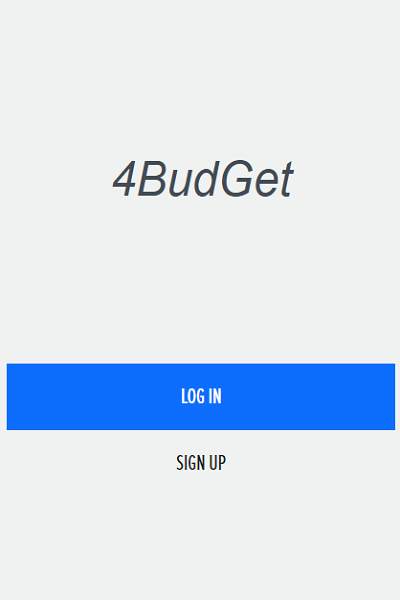
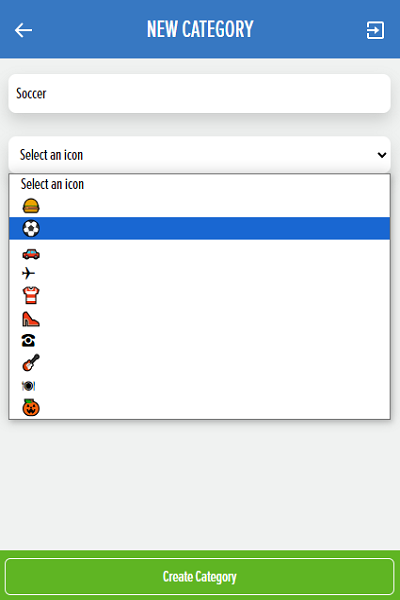
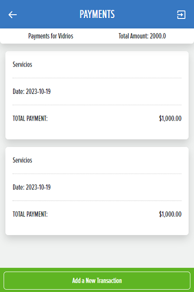
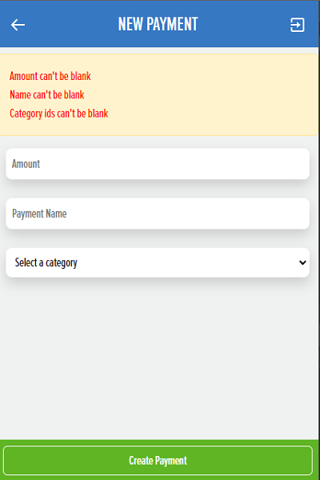

# 4Budget: Personal Finance Management App

## 📗 Table of Contents

- [📖 About the Project](#about-project)
- [🎨 Design](#design)
- [💻 Live Demo](#live-demo)
- [📸 Screenshots](#screenshots)
- [🛠 Setup](#setup)
  - [Prerequisites](#prerequisites)
  - [Usage](#usage)
- [🚀 Interactions](#interactions)
  - [Splash Screen](#splash-screen)
  - [Sign Up and Log In](#sign-up-and-log-in)
  - [Home Page (Categories Page)](#home-page-categories-page)
  - [Transactions Page](#transactions-page)
  - [Add a New Category Page](#add-a-new-category-page)
  - [Add a New Transaction Page](#add-a-new-transaction-page)
- [🧪 Testing Requirements](#testing-requirements)
- [🔧 Technical Requirements](#technical-requirements)
- [👥 Authors](#authors)
- [📜 License](#license)

## 📖 About the Project <a name="about-project"></a>

Welcome to 4Budget, your personal finance management application built with Ruby on Rails. This app helps you manage your expenses efficiently by organizing transactions into categories and providing insightful financial data. Keep track of your spending, create new categories, and add transactions with ease.

This project is inspired by the original design idea by Gregoire Vella on Behance, and it is used under the Creative Commons license.

## 🎨 Design <a name="design"></a>

4Budget follows a clean and intuitive design, emphasizing:

- **Colors:** Utilizes a harmonious color scheme for a pleasant user experience.
- **Typography:** Employs readable font faces, sizes, and weights for clear content presentation.
- **Layout:** Ensures balanced composition and appropriate spacing between elements for a visually appealing interface.

- Credit to the original design idea goes to Gregoire Vella, and appropriate credit is given in compliance with the Creative Commons license.

## 💻 Live Demo  <a name="live-demo"></a>

- Live-Demo: [4Budget](https://budget-app-y2fh.onrender.com)

## 📸 Screenshots <a name="screenshots"></a>





### 🛠 Setup <a name="setup"></a>

1. **Clone the Project Repository:**

   ```bash
   git clone https://github.com/PabloBona/budget.git
   ```
   
2. **Navigate to the Project Folder:**

   ```bash
   cd budget
   ```

### Prerequisites <a name="prerequisites"></a>

Before you can run 4Budget, ensure you have the following prerequisites and configurations in place:

- **Ruby**: Verify that Ruby is installed on your machine by running `ruby -v` in your terminal. If not, download and install Ruby from the [official Ruby website](https://www.ruby-lang.org/en/documentation/installation/).

- **Ruby on Rails**: Install the Ruby on Rails framework using the following command if you haven't already:

  ```bash
  gem install rails
  ```

- **Code Editor**: Use a code editor like Visual Studio Code (VSCode). If you don't have it, download it from the [official website](https://code.visualstudio.com/).

- **Git**: Make sure Git is installed and configured for version control. Download Git from the [official Git website](https://git-scm.com/downloads).

- **PostgreSQL**: Install and properly configure PostgreSQL on your development server. 4Budget assumes the use of PostgreSQL as the default database. Download PostgreSQL from the [official PostgreSQL website](https://www.postgresql.org/download/).

- **Ruby on Rails Configuration**: Configure your Ruby on Rails project to use PostgreSQL as the default database.

With these prerequisites and configurations in place, you're ready to set up and run 4Budget.

### 📖 Usage <a name="usage"></a>

Follow these steps to use 4Budget:

1. **Open your Terminal:**

   Navigate to the directory where the project files are located:

   ```bash
   cd /path/to/your/project/files
   ```

2. **Start the Rails Server:**

   ```bash
   rails server
   ```

3. **Access 4Budget:**

   Open your web browser and go to [http://localhost:3000](http://localhost:3000) to access 4Budget and manage your personal finances efficiently.

## 🚀 Interactions <a name="interactions"></a>


### Splash Screen <a name="splash-screen"></a>

The splash screen displays the app's name and provides links to the sign-up and log-in pages.

### Sign Up and Log In <a name="sign-up-and-log-in"></a>

Users can register with their full name, email, and password. Returning users can log in with their email and password.

### Home Page (Categories Page) <a name="home-page-categories-page"></a>

- Displays a list of categories with their names, icons, and total transaction amounts.
- Clicking on a category navigates the user to the transactions page for that category.
- Provides an option to add a new category.

### Transactions Page <a name="transactions-page"></a>

- Lists transactions for a specific category, ordered by the most recent.
- Displays the total amount for the category.
- Allows users to add new transactions.
- Users can navigate back to the home page.

### Add a New Category Page <a name="add-a-new-category-page"></a>

- Users can create a new category by providing a name and icon.
- Offers a "Save" button to create the category.
- Users can navigate back to the home page.

### Add a New Transaction Page <a name="add-a-new-transaction-page"></a>

- Users can create a new transaction with a name, amount, and one or more categories.
- Provides a "Save" button to create the transaction.
- Users can navigate back to the transactions page for the relevant category.

## 🧪 Testing Requirements <a name="testing-requirements"></a>

Comprehensive unit and integration tests are implemented for all essential components of the 4Budget Ruby on Rails application.

## 🔧 Technical Requirements <a name="technical-requirements"></a>

- **Database:** Postgres is used as the database.
- **Authentication:** Devise gem is employed for user authentication.
- **Validation:** All user inputs are validated to enhance security.
- **Deployment:** The app is deployed and accessible online.

## 👥 Authors <a name="authors"></a>

👤 **Pablo Bonasera**
- GitHub: [@PabloBona](https://github.com/PabloBona)
- LinkedIn: [Pablo Bonasera](https://www.linkedin.com/in/pablo-bonasera/)

## 📜 License <a name="license"></a>

This project is licensed under the [MIT License](https://github.com/PabloBona/budget/blob/dev/MIT.md) as required by the original design idea by Gregoire Vella on Behance under the Creative Commons license.